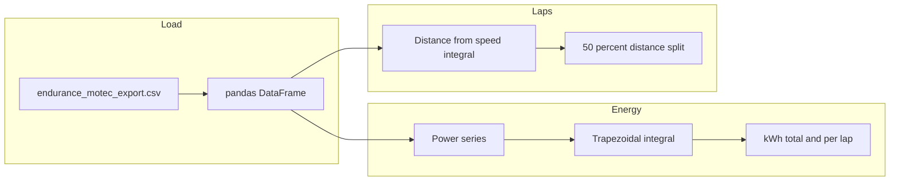

# Task 4: Endurance CSV — energy (kWh) and behaviour insights

## Brief from [Electronics_Recruitment_SD.pdf](c:\Users\Sudarshan\Downloads\MUR Tasks\Electronics_Recruitment_SD.pdf)

**Task 4** asks you to:

1. Use the linked endurance CSV (you already have `[endurance_motec_export.csv](c:\Users\Sudarshan\Downloads\MUR Tasks\endurance_motec_export.csv)` locally — same source as the Google Drive link in the PDF).
2. **Find and calculate total energy used across both laps (kWh).**
3. **Find, report, and visualise** insights into car behaviour (strengths/weaknesses), with **code and visualisations** (the brief also mentions models — optional/simple correlations or rolling stats are enough unless you want to go further).

`[MUR.py](c:\Users\Sudarshan\Downloads\MUR Tasks\MUR.py)` is currently a placeholder (`yoo`); it will be replaced with a single runnable script.

---

## Data you will use

From the CSV header (line 1), the run is **~100 Hz** (`Time` step 0.01 s), **~454.6 s** total (`[endurance_motec_export.csv](c:\Users\Sudarshan\Downloads\MUR Tasks\endurance_motec_export.csv)` tail shows `Time` up to ~454.59).

**Energy (primary columns):**

- `Car Data Battery BatteryPower` — direct battery power (integrate over time after verifying units).
- `Car Data Battery PackInstantaneousVoltage` × `Car Data Battery PackCurrent` — cross-check: P = V \times I (resolve sign: discharge vs regen).

**Lap / motion:**

- `Car Data Driver Speed` — integrate to approximate distance for **lap splitting** (no explicit lap counter in the file).

**Behaviour / insights:**

- `Car Data Driver ThrottlePressure`, `Car Data Motor MotorRPM`, `Car Data Inverter InverterCMDTorque` / `InverterFDBTorque`
- Brakes: `Car Data Driver FrontBrakePressure`, `RearBrakePressure`
- Pack: `Car Data Battery PackSOC`, temps (`HotSpotTemp`, cell temps), `Car Data Inverter InverterTemp`, `Car Data Motor MotorTemp`
- Cooling: `Car Data Water WaterTempIn` / `Out`, `WaterPressureIn` / `Out`

---

## Energy in kWh (method)

1. **Load** with `pandas` (`read_csv`), parse numeric columns, coerce errors to NaN.
2. **Derive time step** from `Time` (prefer `np.diff(Time)` with median dt for robustness; expect ~0.01 s).
3. **Power series**
  - Prefer `BatteryPower` if present and sensible after NaN handling (forward-fill short gaps, drop leading all-NaN rows if needed).  
  - **Backup** `P = PackInstantaneousVoltage * PackCurrent` (document BMS sign: positive = discharge vs regen).
4. **Integrate**: trapezoidal rule on `(P, t)` — `numpy.trapz` or manual trapezoids — gives energy in **Joules** if P is watts; E_{\mathrm{kWh}} = E_{\mathrm{J}} / 3.6\times 10^6.
5. **Report**
  - **Net** energy (signed integral: regen reduces net use).  
  - Optionally **discharge-only** energy (integrate `max(P, 0)`) if you want “energy used” in a stricter sense — **state in the printed summary** which definition you report.

---

## Splitting “both laps” (no lap channel)

The CSV has **no lap index**. Use a **clear, documented assumption**:

- **Recommended default**: split at **50% of cumulative distance** from integrating speed (trapezoidal integration of speed vs time).  
  - Assume **km/h** for `Car Data Driver Speed` (typical Motec); convert to m/s before distance: s = \int v  dt.  
  - Index where cumulative distance first reaches `total_distance / 2` → boundary between lap 1 and lap 2.
- **Fallback** if speed is unreliable for a stretch: split at **mid-time** (`T/2`) and print a warning that this is a weaker proxy.

Compute **kWh per lap** and **total** for the same power series.

---

## Visualisations and insights (keep it focused, “creative” but honest)

Suggested **matplotlib** figures (saved as PNGs next to the script or a single multi-page PDF — your choice; default: a few PNGs):

| Figure                                              | Purpose                               |
| --------------------------------------------------- | ------------------------------------- |
| Speed vs time + lap boundary vertical line          | Shows run structure and lap split     |
| Battery power vs time (or smoothed rolling mean)    | Duty cycle, peaks, regen pockets      |
| Histogram or time-in-band of power                  | Where the car spends electrical power |
| SOC vs time                                         | Energy accounting sanity check        |
| Throttle vs torque or power (scatter or 2D density) | Driver / traction behaviour           |
| Brake pressures vs time (or vs speed)               | Braking style                         |

**Print** a short text block: total kWh, per-lap kWh, duration, mean speed, peak power, regen fraction (if negative power exists), and 2–3 bullet “insights” tied to the plots (e.g. high power at low speed → traction-limited launches; thermal headroom from inverter/motor temps).

Optional **lightweight “model”**: rolling correlation between throttle and power, or simple linear regression of `BatteryPower` on throttle + speed for a qualitative “how much power is explained by demand” — only if it adds clarity.

---

## Script structure (`[MUR.py](c:\Users\Sudarshan\Downloads\MUR Tasks\MUR.py)`)

- `main()`: path to CSV via constant or `pathlib` relative to script / `sys.argv[1]`.
- Functions: `load_log()`, `energy_kwh()`, `lap_split_by_distance()`, `plot_insights()`.
- `if __name__ == "__main__":` guard.
- **Dependencies**: `pandas`, `numpy`, `matplotlib` (install with `pip install pandas numpy matplotlib`).

---

## What you will deliver

- Runnable **one-file** analysis in `[MUR.py](c:\Users\Sudarshan\Downloads\MUR Tasks\MUR.py)`.
- Console output for **kWh (total + per lap)** with **explicit assumptions** (power definition, lap split).
- **Several saved plots** (or one figure with subplots) supporting the written insights.

No separate README or markdown unless you ask for it later.

