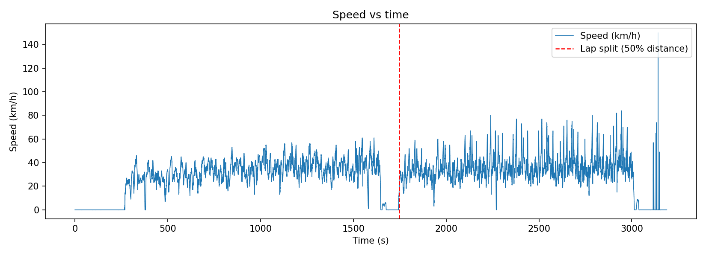
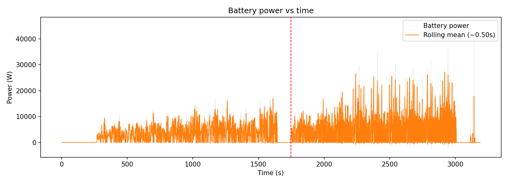
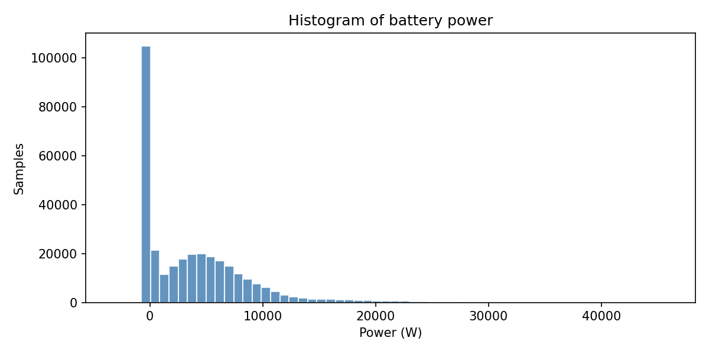
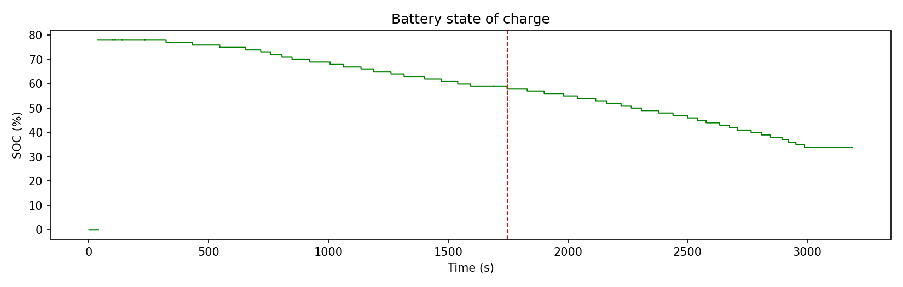
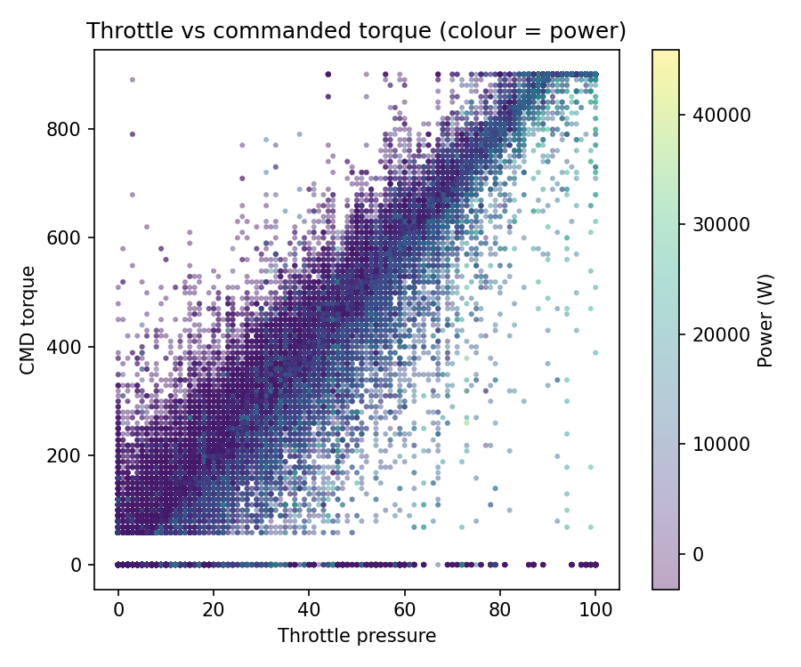
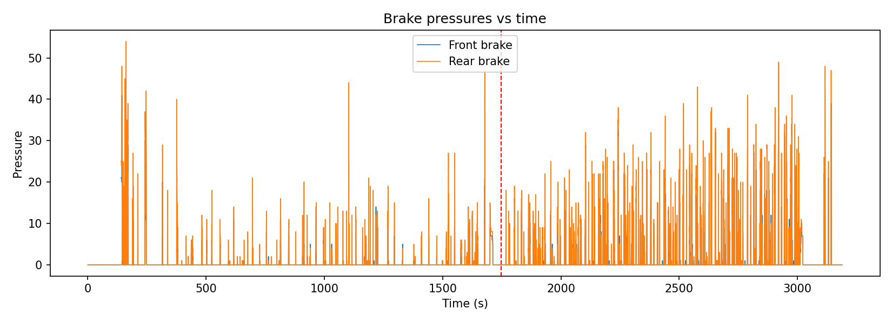

# Task 4 Final Documentation

This document summarizes the endurance-run analysis from `endurance_motec_export.csv`, combining:
- core visualizations from `MUR.py`
- advanced KPI analytics from `MUR_advanced_analysis.py`

## Headline Results

- Net energy (signed): **3.4594 kWh**
- Discharge-only energy: **3.4658 kWh**
- Regen recovered (absolute): **0.0064 kWh** (**0.18%** of discharge)
- Run duration: **3188.85 s**
- Approximate distance (speed-integrated): **25.797 km**

---

## Visualizations (with 2-3 line interpretation each)

### 1) Speed vs Time with Lap Split

This plot shows speed variation across the full run and the red dashed lap split used in analysis.  
The split is based on 50% cumulative distance (proxy method), so it enables lap-wise comparison without an explicit lap counter.  
The second half appears more active at higher speeds than the first half.

### 2) Battery Power vs Time

The gray trace is instantaneous battery power, while the orange trace is a short rolling mean for trend clarity.  
Power demand is highly transient, with repeated spikes rather than a flat baseline.  
This behavior aligns with acceleration-driven energy use instead of steady cruise draw.

### 3) Battery Power Histogram

The histogram shows how often each power band occurs throughout the run.  
Most samples sit in lower-to-mid power ranges, with a long high-power tail from short bursts.  
This confirms that peak events exist, but they are not the dominant time occupancy.

### 4) SOC vs Time

SOC trends down gradually over the run, consistent with net positive battery energy use.  
The progression is relatively smooth, with no severe discontinuities that would suggest major sensor instability.  
This provides a useful cross-check against integrated kWh results.

### 5) Throttle vs Commanded Torque (Colored by Power)

Higher throttle generally corresponds to higher commanded torque, with color showing larger electrical power in that region.  
Spread at similar throttle indicates additional dependence on vehicle state (speed/load), not pedal alone.  
This plot helps explain driver demand versus electrical response.

### 6) Brake Pressures vs Time

Front and rear brake pressure traces identify repeated braking windows and their intensity.  
The distribution and overlap of pressure traces provide a view of braking style and balance behavior over time.  
These windows can be aligned with event-detection outputs for deeper review.

---

## Advanced Analytics Outputs (with 2-3 line interpretation each)

### 1) Mode Energy Breakdown (`mur_mode_energy_breakdown.csv`)

This table partitions energy by operating mode (accel, cruise, braking, idle, etc.).  
In this run, acceleration mode contributes the largest share of discharge energy, indicating burst-demand dominance.  
Cruise and idle consume far less by comparison, which is useful for strategy prioritization.

### 2) Regen Effectiveness (`mur_regen_summary.json`)

This summary reports net energy, discharge-only energy, and recovered regen energy in one place.  
Regen recovery is small (~0.18% of discharge), so current operation gains minimal endurance benefit from regen in this dataset.  
That result can guide whether calibration effort should focus on regen tuning or elsewhere.

### 3) Data Quality Audit (`mur_data_quality_report.json`)

This report evaluates timing consistency, missing-data fractions, and long constant-value runs for key channels.  
It establishes confidence boundaries for the analysis by documenting data health before interpretation.  
Including this audit strengthens defensibility of conclusions in technical review.

### 4) Speed-Band Efficiency (`mur_speed_band_efficiency.csv`)

This computes discharge energy intensity by speed band as Wh/km.  
It highlights where energy cost per kilometre rises, helping identify inefficient operating regimes.  
These bands are practical for endurance pacing and drive-strategy discussion.

### 5) Event Detection (`mur_events.csv`)

This table captures timestamps and durations of hard acceleration, hard braking, and regen windows.  
It converts dense telemetry into discrete, reviewable events that are easy to inspect and communicate.  
These events can be used to connect driver behavior, power demand, and efficiency outcomes.

---

## Notes on Method Assumptions

- Pack power uses logged battery power with scaling consistent with 0.1 V / 0.1 A Motec-style raw units (division by 100 to watts).
- Distance and lap split are inferred from speed integration; no explicit lap counter exists in the file.
- Short gaps are forward/backward filled for continuity; remaining NaNs are handled conservatively for stable integration.

