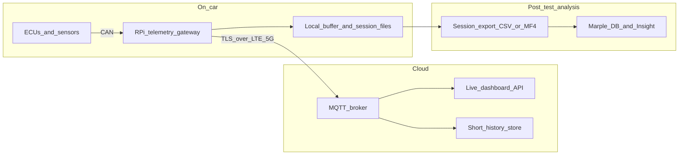

# Task 5: DAQ and Telemetry Stack Design

## Scope

This proposal is for a **Formula SAE live telemetry stack** where the car has a **Raspberry Pi** with an **LTE/5G uplink**. The goal is not to build a permanent enterprise data platform. The goal is to give the team:

- reliable live telemetry during testing,
- short-term history for quick debugging after a run,
- a clean path to move completed test data into **Marple** for deeper analysis.

This design assumes the car already has one or more ECUs producing data on **CAN**, and the Raspberry Pi acts as a **telemetry gateway**, not as the safety-critical control computer.

## Assumptions

- Vehicle data already exists on one or more CAN buses.
- Most important live channels are relatively low bandwidth after decoding and decimation, even if some raw buses are busy.
- The team values **reliability and simplicity** more than chasing the absolute lowest possible cloud latency.
- Cellular coverage at test venues is variable, so the system must degrade gracefully when uplink quality drops.
- Engineers need both:
  - a **live view** for safety and debugging during a run,
  - a **post-run workflow** that lands data in **Marple** with consistent naming and metadata.
- Short-term history means **minutes to hours**, not long-term archival in the live telemetry stack itself.

## Goals and Priorities

I would optimize for these goals in this order:

1. **Do no harm to the car.** Telemetry failure must never affect control, torque, or shutdown behavior.
2. **Graceful degradation.** If LTE drops, the Pi should buffer locally and reconnect cleanly.
3. **Low operational burden.** A student team should be able to deploy, debug, and recover it trackside.
4. **Useful live latency.** The live view should be fast enough for human monitoring, not hard real-time control.
5. **Consistent post-test analysis.** Data exported to Marple should use the same signal names, units, and metadata as the live stream.
6. **Reasonable security.** Use authenticated devices and encrypted transport without making the system painful to operate.

## Recommended Architecture



### On-car components

- **CAN ingest** on the Pi using SocketCAN or a stable CAN interface driver.
- **Decoder service** that maps CAN frames to engineering values using a **DBC** or equivalent signal definition file.
- **Local ring buffer** for recent decoded telemetry, so the latest part of the session survives temporary network loss.
- **Session logger** that writes compact local files for each run.
- **Cellular uplink client** that publishes selected live channels to the cloud.

### Cloud components

- **MQTT broker** as the main ingestion point for live data.
- **Small live telemetry service** that subscribes to MQTT and feeds the dashboard.
- **Short-history store** for recent telemetry, such as the last few hours or last few sessions.
- **Simple dashboard** for engineers in the pits or workshop.

### Post-test path

- At the end of a run, the Pi keeps or uploads a session file.
- That file is standardized and then pushed into **Marple** for deeper analysis, sharing, and dashboarding.

## Why I Would Choose This Stack

### Transport: MQTT for live telemetry

I would use **MQTT over TLS** between the Raspberry Pi and the cloud.

Why it fits this use case:

- It is lightweight and efficient on unreliable mobile links.
- It supports a natural **publish/subscribe** model for many signals and many viewers.
- It handles reconnects and intermittent connectivity better than a custom raw socket solution.
- It is common in embedded and telemetry systems, so it is easier to maintain.

Disadvantages:

- MQTT adds broker infrastructure to operate.
- It is not as directly browser-friendly as plain WebSockets, so the dashboard usually needs a backend service or a WebSocket bridge.
- Topic design and QoS choices need discipline or the system becomes messy.

### Payload format: Protobuf on the wire, JSON at the edges

I would use **Protobuf** or another compact binary schema for Pi-to-cloud messages, then convert to **JSON** where convenient for frontend/debug tooling.

Why:

- Binary payloads are smaller, which matters on cellular links.
- Schemas reduce ambiguity in units and signal types.
- The backend can still expose JSON to the web UI for convenience.

Disadvantages:

- Binary payloads are less convenient to inspect manually during debugging.
- Schema evolution needs versioning discipline.

If the team wants maximum simplicity for an early prototype, starting with **JSON** everywhere is acceptable, but I would expect to move to a schema-based format once the signal list stabilizes.

### Edge storage: ring buffer plus per-session files

I would not try to store every live point forever in the cloud path. Instead:

- keep a **ring buffer** on the Pi for recent live history,
- write a **session file** locally for each test,
- upload or sync session files when the run ends or bandwidth is available.

This separates two jobs cleanly:

- **live monitoring** needs fast, recent data,
- **engineering analysis** needs complete, coherent session files.

### Cloud shape: simple managed or single-container deployment

For a student team, I would choose one of these:

1. **Small VPS / VM** running:
   - MQTT broker,
   - backend API,
   - short-history database,
   - dashboard.
2. **Managed MQTT + small app service**, if the team is comfortable with cloud services and wants less infrastructure work.

My default recommendation would be a **small VM** first.

Why:

- It is easier to understand and debug.
- Costs are predictable.
- It avoids early vendor lock-in.
- The team can containerize everything with Docker and reproduce the same environment locally.

Disadvantages:

- The team owns uptime and patching.
- A single VM is less scalable and less fault tolerant than a managed architecture.

For Formula SAE, that tradeoff is usually acceptable because the scale is modest and simplicity matters more than hyperscale design.

## Data Flow

### 1. Acquisition on the car

- ECUs publish raw measurements on CAN.
- The Raspberry Pi timestamps incoming frames as they are received.
- A decoder maps CAN IDs and bitfields into named signals with units.
- The system tags each sample with:
  - session ID,
  - monotonic timestamp,
  - wall-clock timestamp,
  - source ECU or bus,
  - signal quality if relevant.

### 2. Live uplink

- The Pi does not uplink every raw frame blindly.
- It publishes a **selected live channel set** at suitable rates.

Examples:

- inverter temperatures at 1 to 5 Hz,
- pack voltage/current at 10 to 20 Hz,
- vehicle speed at 10 to 20 Hz,
- wheel speeds at moderate rate if they are useful live,
- raw high-rate debug channels only when explicitly enabled.

This matters because sending everything at full bus rate wastes bandwidth and makes dashboards noisy. The live path should prioritize signals that help the team make decisions during a run.

### 3. Local buffering and recovery

- A memory-backed or lightweight disk-backed ring buffer stores recent decoded telemetry.
- Session files are chunked so power loss or process crashes do not destroy the whole run.
- If cellular drops, the live publisher queues what is reasonable, then resumes when the link returns.
- The dashboard should clearly show whether data is live, delayed, or disconnected.

### 4. Short-term history in the cloud

The cloud side keeps a short retention store for recent viewing. This could be:

- **TimescaleDB/PostgreSQL** if the team wants SQL and straightforward operations,
- or a simpler document/time-series store if the backend is minimal.

I would choose **TimescaleDB/PostgreSQL** because it is mature, flexible, and easy to query for recent sessions, alarms, and quick dashboards.

## Suggested Deployment

### On-car

- Raspberry Pi running Linux.
- System services managed with `systemd`.
- One service for CAN decode/logging.
- One service for live publish.
- One watchdog or health-check process.
- Optional local web UI for connection status and quick diagnostics.

Why `systemd`:

- It is simple, already present, restarts failed services, and is easy to inspect trackside.

### Cloud

- Docker Compose on a small VM:
  - MQTT broker,
  - backend service,
  - PostgreSQL/TimescaleDB,
  - dashboard frontend,
  - optional reverse proxy.

This is a strong baseline because the team can run the same stack on a laptop for development and on a VM for deployment.

## Advantages and Disadvantages Relative to Team Needs

| Area | Chosen approach | Advantages | Disadvantages |
| --- | --- | --- | --- |
| Live telemetry | MQTT over TLS | Efficient over LTE, reconnect-friendly, pub/sub fits many signals and viewers | Needs broker and topic discipline |
| Browser viewing | Backend subscribes and serves UI | Cleaner security model, easier aggregation and auth | Slightly more components than direct browser sockets |
| Short-term history | TimescaleDB/PostgreSQL | Familiar tooling, SQL queries, easy recent-session views | More operational overhead than a flat-file-only approach |
| On-car storage | Ring buffer plus session files | Works through outages, preserves full runs | Needs clear retention management |
| Message schema | Protobuf | Smaller payloads, better type control | Less human-readable during debugging |
| Deployment | Single VM with containers | Simple, cheap, reproducible | Single point of failure unless expanded later |

## What I Would Not Do

- I would **not** stream raw CAN traffic directly to the public cloud without decoding and filtering.
- I would **not** make the telemetry path a required dependency for vehicle operation.
- I would **not** optimize first for permanent cloud archival, because the brief is explicitly about live telemetry and short-term history.
- I would **not** create separate signal naming conventions for live telemetry and post-test analysis, because that makes engineering workflows inconsistent.

## Moving Test Data to Marple

This is a key part of the design because the team already uses Marple.

Based on Marple’s current documentation:

- Marple supports **file-based ingestion** such as **CSV** and **MDF/MF4**.
- Marple also supports SDK-based workflows and real-time datastream options.
- The Python SDK supports pushing files into a stream programmatically.

Relevant references:

- [https://www.marpledata.com/motorsport](https://www.marpledata.com/motorsport)
- [https://docs.marpledata.com/docs/marple-db/datastreams](https://docs.marpledata.com/docs/marple-db/datastreams)
- [https://docs.marpledata.com/docs/sdk/overview/python-sdk](https://docs.marpledata.com/docs/sdk/overview/python-sdk)

### Recommended Marple workflow

1. **Decode once** on the Pi or in the backend using the team’s canonical signal definitions.
2. **Write a session file** per run in a stable export format.
3. **Attach metadata** such as:
   - driver,
   - track,
   - vehicle config,
   - test date,
   - weather if useful,
   - software version,
   - battery pack/config revision.
4. **Push the finished session file to Marple** after the run, either:
   - automatically via the Python SDK,
   - or manually through the Marple UI if the team wants a simpler first version.
5. Use the same **signal names and units** in live telemetry and in exported files so engineers do not mentally translate between systems.

### Why file-based upload is the right default

For this team and this brief, I would treat **Marple as the post-run system of record**, and use **file upload** as the main bridge.

Why:

- It is robust and easy to reason about.
- It preserves complete runs rather than partial live slices.
- It matches Marple’s strength as a collaborative analysis platform for telemetry files and derived metrics.
- It keeps the live stack simpler.

### Example process

At the end of a test:

1. The Pi finalizes `session_YYYYMMDD_HHMMSS`.
2. It exports decoded data to `CSV` or `MF4`.
3. It writes a metadata block for driver, car state, and test conditions.
4. A sync job uploads the file to Marple.
5. Engineers open the run in Marple for overlays, metrics, and comparisons.

A simple automated upload job could look like this:

```python
from marple import DB

db = DB("API_TOKEN", "https://db.marpledata.com/api/v1")
stream = db.get_stream("Car data")

dataset = stream.push_file(
    "session_20260325_153000.csv",
    metadata={
        "driver": "Sudarshan",
        "track": "Skidpad_Test",
        "car_config": "baseline_aero",
        "firmware_version": "v1.12.3",
    },
)
dataset.wait_for_import(timeout=30)
```

That is attractive because it is simple, scriptable, and easy to tie into the end-of-session workflow.

Optional later improvement:

- stream a reduced real-time feed into Marple datastreams as well,
- but keep the post-run file import path even if real-time integration is added.

That gives the team a safe initial system and a clear growth path.

## Security and Operational Considerations

### Security

- Use **TLS** for all cloud traffic.
- Give each Pi its own device credentials.
- Keep API tokens and certificates out of the repository.
- Restrict inbound cloud access to only what the dashboard and devices need.
- Prefer VPN or private-network style access for admin tools if possible.

### Operational behavior

- Telemetry service startup should be automatic on boot.
- Services should restart automatically after crashes.
- Logs should be readable locally without cloud access.
- The system should expose clear health states:
  - CAN connected,
  - decoder healthy,
  - LTE connected,
  - broker connected,
  - buffering active,
  - upload pending.

### Failure cases and expected behavior

- **LTE outage:** continue logging locally, pause live publish, resume when connected.
- **Cloud outage:** continue logging locally and mark uploads pending.
- **Pi reboot during session:** recover partial chunk files if possible and continue cleanly.
- **Decoder mismatch after firmware change:** reject or version the affected signals clearly rather than silently ingesting wrong engineering values.

## Why This Design Matches Formula SAE Needs

A Formula SAE team usually needs a telemetry system that is:

- quick to deploy,
- easy to explain,
- robust to patchy test-day connectivity,
- good enough for live decisions,
- and tightly connected to post-run engineering analysis.

This design does that by separating concerns:

- the **car** focuses on safe data production,
- the **Pi** handles gateway, buffering, and export,
- the **cloud** handles live monitoring and recent history,
- **Marple** handles richer engineering analysis after the session.

That separation keeps the system practical for a student team while still leaving room for future upgrades.

## Final Recommendation

If I were deploying this for the team now, I would start with:

- **On car:** Raspberry Pi + CAN interface + DBC-based decoder + local session logger.
- **Live transport:** MQTT over TLS.
- **Cloud:** small Dockerized VM with broker, backend, and TimescaleDB/PostgreSQL.
- **Post-test analysis:** export each run as CSV or MF4 and upload it into Marple with metadata using the Python SDK or UI.

That stack is not the fanciest option, but it is the one I would trust most to work repeatedly with a small team, limited time, and real trackside constraints.
